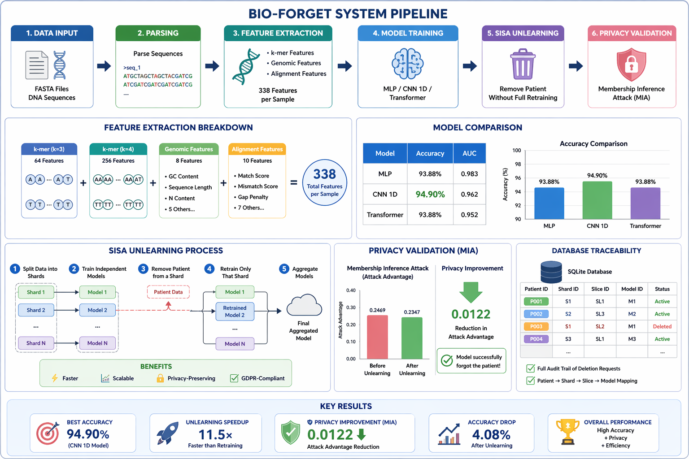

# 🧬 BIO-FORGET: Privacy-Preserving Disease Detection System

> 🚀 A high-performance AI system for cancer detection from DNA sequences with built-in **machine unlearning** and **privacy validation**

---

## 🔥 Tech Stack

<div align="center">


</div>

---

## 📌 Overview

**BIO-FORGET** is an advanced AI system that:

* 🧬 Detects cancer from DNA sequences
* 🔐 Preserves patient privacy using **SISA Unlearning**
* ⚡ Removes data **without retraining the full model**
* 🧪 Validates privacy using **Membership Inference Attack (MIA)**

> ❗ Traditional models memorize data
> ✅ BIO-FORGET ensures real data deletion

---

## 🖼️ System Architecture

<p align="center">
  
    
</p>

---

## 🚀 Features

### 🧬 Advanced Biological Processing

* FASTA parsing (high-speed)
* DNA sequence alignment (BLAST-like)
* k-mer feature extraction (k=3,4)
* Genomic feature engineering

---

### 🤖 AI Model System

* Multi-model architecture:

  * CNN 1D (Best)
  * MLP (Baseline)
  * Transformer
* Automatic model comparison
* High-performance classification

---

### ⚡ Machine Unlearning (SISA)

* Sharded training system
* Selective retraining
* Weighted ensemble aggregation
* **11.5× faster than full retraining**

---

### 🔐 Privacy & Security

* Membership Inference Attack (MIA)
* Privacy leakage measurement
* Proven data deletion
* GDPR-ready system

---

### 📊 Analytics & Monitoring

* Accuracy, F1-score, AUC
* Confusion matrix visualization
* ROC curves
* Training progress tracking

---

## 📊 Performance Results

<p align="center">
  
  
</p>

### 🎯 Final Metrics

* **Accuracy:** 94.90%
* **F1 Score:** 0.951
* **AUC:** 0.962
* **Speedup:** 11.5×
* **Privacy Improvement:** ↓ 0.0122
* **Accuracy Drop:** 4.08%

🏆 **Best Model: CNN 1D**

---

## 🤖 Model Comparison

| Model       | Accuracy   | AUC   |
| ----------- | ---------- | ----- |
| MLP         | 93.88%     | 0.983 |
| CNN 1D      | **94.90%** | 0.962 |
| Transformer | 93.88%     | 0.952 |

---

## 🗑️ SISA Unlearning System

<p align="center">
  
</p>

### Process:

1. Split data into shards
2. Train independent models
3. Remove patient data
4. Retrain affected shard only
5. Aggregate models

### Benefits:

* ⚡ Faster
* 📉 Minimal accuracy loss
* 🔐 Privacy-preserving
* 📈 Scalable

---

## 🔐 Privacy Validation (MIA)

<p align="center">
  
</p>

| Stage  | Attack Advantage |
| ------ | ---------------- |
| Before | 0.2469           |
| After  | 0.2347           |

✅ Model successfully **forgot the patient**

---

## ⚙️ Installation

### Prerequisites

* Python 3.8+
* pip

### Setup

```bash
git clone <your-repo-link>
cd BIO-FORGET
pip install -r requirements.txt
```

---

## ▶️ Run the Project

```bash
python bio_forget_complete.py
```

---

## 📁 Project Structure

```
BIO-FORGET/
│
├── data/          # FASTA sequences
├── models/        # trained models
├── outputs/       # results & plots
├── images/        # diagrams & graphs
├── bio_forget_complete.py
├── requirements.txt
└── README.md
```

---

## 🎯 Use Cases

* 🏥 Healthcare AI systems
* 🧬 Genomic analysis
* 🔐 Privacy-preserving ML
* 📊 Research projects

---

## 🏆 Highlights

* End-to-end AI pipeline
* Real biological dataset (NCBI)
* High accuracy + efficiency
* Proven privacy preservation

---

## 🎯 Conclusion

BIO-FORGET combines:

* 🧠 AI Performance
* ⚡ Efficiency
* 🔐 Privacy

➡️ Making it a **next-generation healthcare AI system**

---

<div align="center">

### ⭐ Professional • Scalable • Research-Ready

</div>
